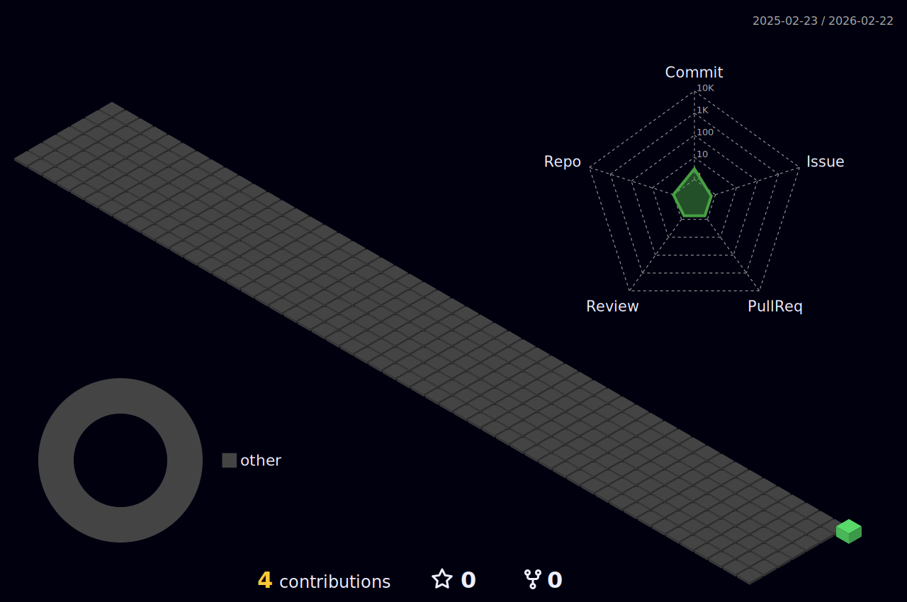

<!-- HEADER -->

<!-- TYPING SVG -->

 

<!-- BADGES -->

&nbsp;

&nbsp;

---

## About Me

I'm a developer, entrepreneur, and creative from **Bad Oeynhausen, Germany** who loves building things — whether it's software, smart home setups, or photo books about abandoned places.

- :computer: **Freelance Full Stack Developer** — TypeScript, React, Next.js
- :house: **Smart Home Educator** — [alles-automatisch.de](https://alles-automatisch.de) & [YouTube](https://youtube.com/@kamerakram) (10k+ subscribers)
- :camera: **Photographer** — specializing in Lost Places & urban exploration ([pixelgranaten.de](https://pixelgranaten.de))
- :books: **Published Author** — 8 books on abandoned places in Germany
- :bricks: **LEGO Enthusiast** — built [brick-storage.com](https://brick-storage.com) to track collections
- :tv: **Featured on** ZDF, WDR, GEO Magazine, BILD & more

---

## Tech Stack

<picture>
  <source media="(prefers-color-scheme: dark)" srcset="https://skillicons.dev/icons?i=ts,js,react,nextjs,nodejs,tailwind,prisma,postgres,redis,docker,vercel,git,github,linux,py,html,css,raspberrypi&theme=dark&perline=9">
  <source media="(prefers-color-scheme: light)" srcset="https://skillicons.dev/icons?i=ts,js,react,nextjs,nodejs,tailwind,prisma,postgres,redis,docker,vercel,git,github,linux,py,html,css,raspberrypi&theme=light&perline=9">
  
</picture>

---

## Projects

> Things I've built and actively maintain

| | Project | Description | |
|:-:|---------|-------------|:-:|
| :house: | **[Alles Automatisch](https://alles-automatisch.de)** | Home Assistant tutorials, automations & smart home education platform |  |
| :mag: | **[Smarthome Finder](https://smarthome-finder.de)** | Smart home product discovery & comparison — find compatible devices for your ecosystem |  |
| :bricks: | **[Brick Storage](https://brick-storage.com)** | Free LEGO collection management & portfolio tracker with 20,000+ sets database |  |
| :iphone: | **[QRVisit](https://qrvisit.de)** | Free QR code generator & digital business card creator for Apple & Google Wallet |  |
| :camera: | **[Pixelgranaten](https://pixelgranaten.de)** | Photography blog & Lost Places documentation — online since 2010 |  |

---

## GitHub Stats

<!-- Stats Card -->
<picture>
  <source media="(prefers-color-scheme: dark)" srcset="https://github-readme-stats.vercel.app/api?username=dnlbbrg&show_icons=true&include_all_commits=true&count_private=true&theme=github_dark_dimmed&hide_border=true&bg_color=00000000&rank_icon=percentile">
  <source media="(prefers-color-scheme: light)" srcset="https://github-readme-stats.vercel.app/api?username=dnlbbrg&show_icons=true&include_all_commits=true&count_private=true&theme=default&hide_border=true&bg_color=00000000&rank_icon=percentile">
  
</picture>
&nbsp;&nbsp;
<!-- Streak Stats -->
<picture>
  <source media="(prefers-color-scheme: dark)" srcset="https://streak-stats.demolab.com?user=dnlbbrg&theme=github-dark-dimmed&hide_border=true&background=00000000">
  <source media="(prefers-color-scheme: light)" srcset="https://streak-stats.demolab.com?user=dnlbbrg&theme=default&hide_border=true&background=FFFFFF00">
  
</picture>

  

<!-- Top Languages -->
<picture>
  <source media="(prefers-color-scheme: dark)" srcset="https://github-readme-stats.vercel.app/api/top-langs/?username=dnlbbrg&layout=compact&langs_count=8&theme=github_dark_dimmed&hide_border=true&bg_color=00000000">
  <source media="(prefers-color-scheme: light)" srcset="https://github-readme-stats.vercel.app/api/top-langs/?username=dnlbbrg&layout=compact&langs_count=8&theme=default&hide_border=true&bg_color=00000000">
  
</picture>

---

## Trophies

<picture>
  <source media="(prefers-color-scheme: dark)" srcset="https://github-profile-trophy.vercel.app/?username=dnlbbrg&no-bg=true&no-frame=true&column=7&theme=algolia&margin-w=5">
  <source media="(prefers-color-scheme: light)" srcset="https://github-profile-trophy.vercel.app/?username=dnlbbrg&no-bg=true&no-frame=true&column=7&theme=flat&margin-w=5">
  
</picture>

---

## Activity Graph

<picture>
  <source media="(prefers-color-scheme: dark)" srcset="https://github-readme-activity-graph.vercel.app/graph?username=dnlbbrg&bg_color=00000000&color=adbac7&line=6366F1&point=A78BFA&area_color=6366F1&area=true&hide_border=true&custom_title=Contribution%20Graph">
  <source media="(prefers-color-scheme: light)" srcset="https://github-readme-activity-graph.vercel.app/graph?username=dnlbbrg&bg_color=00000000&color=24292f&line=6366F1&point=A78BFA&area_color=6366F1&area=true&hide_border=true&custom_title=Contribution%20Graph">
  
</picture>

---

## Contribution Snake

<picture>
  <source media="(prefers-color-scheme: dark)" srcset="https://raw.githubusercontent.com/dnlbbrg/dnlbbrg/output/github-snake-dark.svg">
  <source media="(prefers-color-scheme: light)" srcset="https://raw.githubusercontent.com/dnlbbrg/dnlbbrg/output/github-snake.svg">
  
</picture>

---

<h2>3D Contributions</h2>

---

## Latest Blog Posts

<!-- BLOG-POST-LIST:START -->- [Home Assistant: Geräte und Automationen mit Labels, Kategorien und Bereichen organisieren](https://alles-automatisch.de/home-assistant-struktur/?utm_source=rss&utm_medium=rss&utm_campaign=home-assistant-struktur) — 3030 D, YYYY
- [Waschmaschine und Co. mit WashData in Home Assistant überwachen](https://alles-automatisch.de/washdata-haushaltsgeraete-ueberwachen/?utm_source=rss&utm_medium=rss&utm_campaign=washdata-haushaltsgeraete-ueberwachen) — 000 D, YYYY
- [SolarEdge und Hoymiles parallel betreiben: Technische Umsetzung und Integration](https://alles-automatisch.de/solaredge-hoymiles-integration/?utm_source=rss&utm_medium=rss&utm_campaign=solaredge-hoymiles-integration) — 000 D, YYYY
- [Home Assistant auf Proxmox installieren: Schnelle Einrichtung als VM](https://alles-automatisch.de/home-assistant-proxmox-installation-2/?utm_source=rss&utm_medium=rss&utm_campaign=home-assistant-proxmox-installation-2) — 000 D, YYYY
- [Proxmox auf Mini-PC installieren: Schritt-für-Schritt-Anleitung](https://alles-automatisch.de/proxmox-installation-mini-pc/?utm_source=rss&utm_medium=rss&utm_campaign=proxmox-installation-mini-pc) — 3030 D, YYYY
<!-- BLOG-POST-LIST:END -->

## Latest YouTube Videos

<!-- YOUTUBE-VIDEO-LIST:START -->
<!-- YOUTUBE-VIDEO-LIST:END -->

---

<h2>Published Books</h2>

I've published 8 photo books documenting abandoned places across Germany, combining photography with historical research.

| # | Title | Region |
|:-:|-------|--------|
| 1 | **Lost Places in Brandenburg** | Brandenburg |
| 2 | **Lost Places in Nordrhein-Westfalen** | North Rhine-Westphalia |
| 3 | **Lost Places in Ostwestfalen-Lippe** | East Westphalia-Lippe |
| 4 | **Verlassene Orte in Niedersachsen** | Lower Saxony |
| 5 | **Verlassene Orte im Ruhrgebiet** | Ruhr Area |
| 6 | **Verlassene Orte in Nordrhein-Westfalen** | North Rhine-Westphalia |
| 7 | **Verlassene Orte in Berlin** | Berlin |
| 8 | **Verlassene Orte in Brandenburg** | Brandenburg |

> *"Verlassene Orte: Die Faszination des Verfalls"* — The Fascination of Decay

<h2>Media & Press</h2>

Featured across German national television, print media, and online publications:

**Television**
- :tv: **ZDF** — drehscheibe, hallo deutschland
- :tv: **WDR** — Lokalzeit, WestArt

**Print & Online**
- :newspaper: **GEO Magazine**
- :newspaper: **BILD**
- :newspaper: **WAZ** (Westdeutsche Allgemeine Zeitung)
- :newspaper: **CanonFoto** Magazine
- :newspaper: **Westfalenblatt**
- :newspaper: **DB Mobil** (Deutsche Bahn)
- :newspaper: **Deutsche BauZeitschrift**
- :newspaper: **Welt der Wunder**

*25+ media features in total across TV, print, and digital publications.*

---

## Connect With Me

---

<!-- DEV QUOTE -->
<picture>
  <source media="(prefers-color-scheme: dark)" srcset="https://quotes-github-readme.vercel.app/api?type=horizontal&theme=dark&border=true">
  <source media="(prefers-color-scheme: light)" srcset="https://quotes-github-readme.vercel.app/api?type=horizontal&theme=light&border=true">
  
</picture>

  

<!-- FOOTER -->

